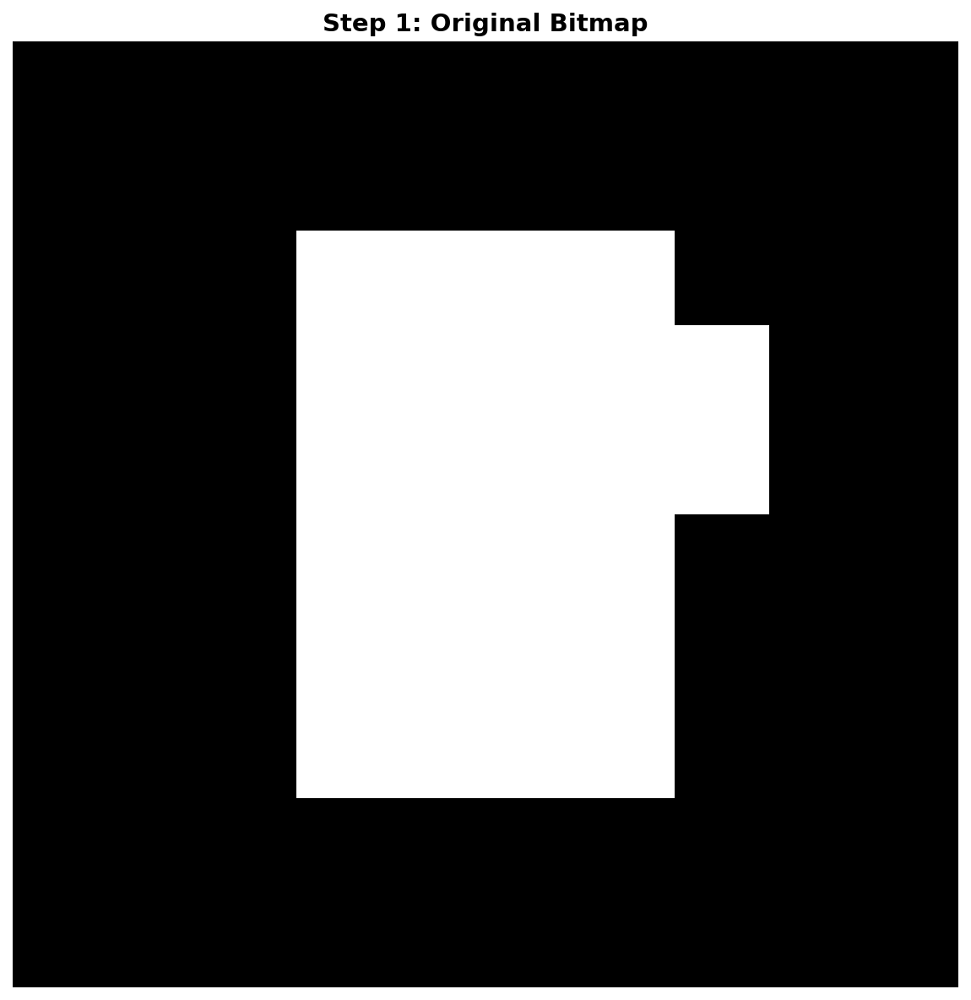
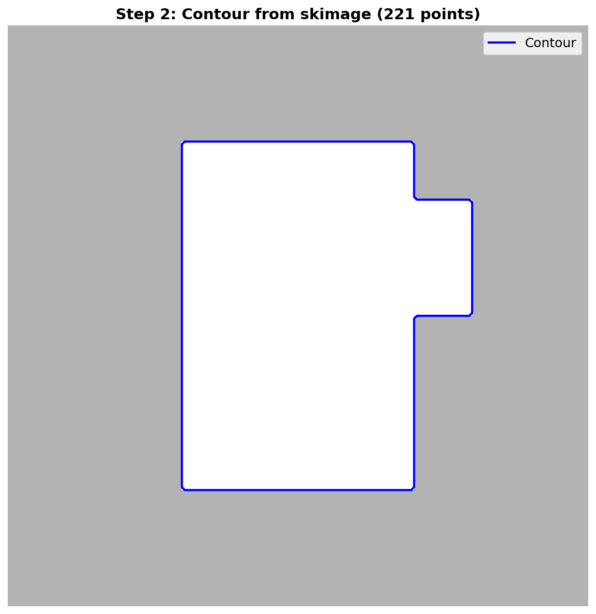
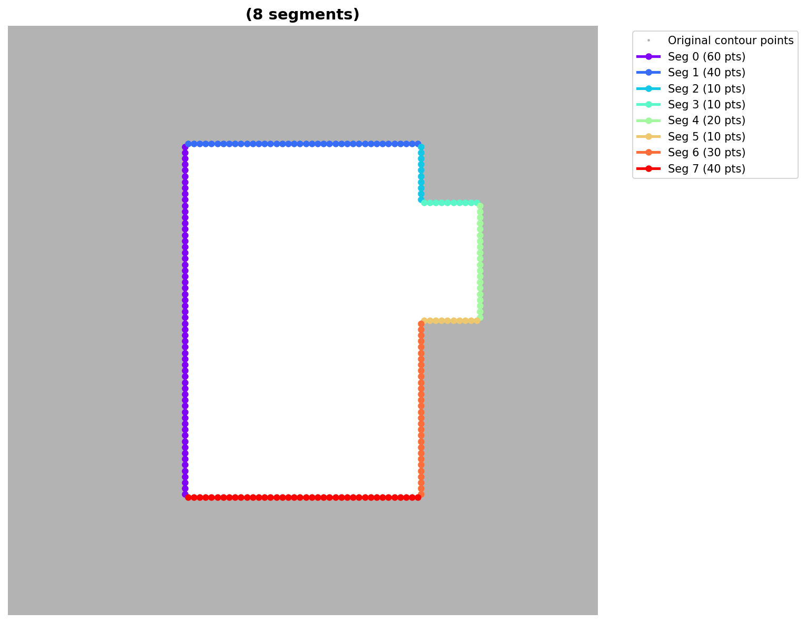

# PolyFit2D
Given a dense polygon or point cloud, fit a polyline with a minimal number of segments.
Useful for post‑processing bitmask segmentation outputs from models such as MaskRCNN or YOLO‑Seg, especially when regular or low‑complexity shapes are required:
- constructing larger structures by matching edges
- obtaining simple geometric representations
Unlike common point‑thinning algorithms (Ramer–Douglas–Peucker, Visvalingam–Whyatt, Zhang–Suen), this method:
- minimizes segment count while preserving the raw shape
- does not shrink the area or remove corners

## Example
A simple example illustrates the workflow:
- The input is a dense bitmask produced by a segmentation model.

- A contour is extracted from the bitmask using skimage.measure.find_contours.

- PolyFit2D fits a minimal‑segment polyline to this contour.

## Performance
The implementation is optimized, uses NumPy broadcasting, and is designed for fast evaluation pipelines on multicore machines.

## Ideas / future work
- further performance improvements
- support for fitting segments using quadratic curves (parabolas) or B‑splines
- support for fitting unordered point sets / point clouds
- consider extension to 3D

