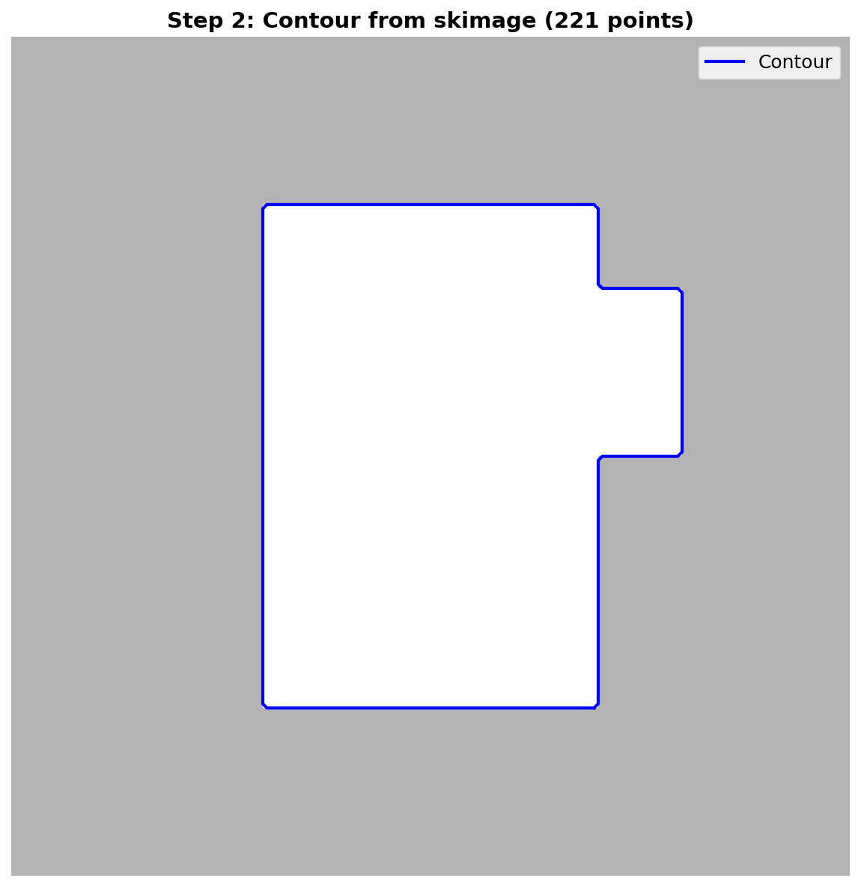

# Mask2PolyMin
Package to turn noisy raster segmentation masks into clean polygons with a minimal number of segments.

Useful for post‑processing bitmask segmentation outputs from models such as MaskRCNN or YOLO‑Seg, especially when regular or low‑complexity shapes are required:
- obtaining simple geometric representations
- to reconstruct artificial objects that consist of straight edges, sharp corners, and regular geometric properties.

Unlike common point‑thinning algorithms (Ramer–Douglas–Peucker, Visvalingam–Whyatt, Zhang–Suen), this method:
- minimizes segment count while preserving the raw shape
- does not shrink the area or remove corners
- reconstructs corners with sub-pixel accuracy: vertices are intersections of least-squares fitted lines.

## Example

python -m venv .venv && source .venv/bin/activate && pip install -r requirements-examples.txt && python example_usage.py

- The input is a dense bitmask produced by a segmentation model.


- A contour is extracted from the bitmask using skimage.measure.find_contours



- Mask2PolyMin fits a minimal‑segment polyline to this contour


- `fit()` returns `(polygon, segments)`: a closed polygon of float (sub-pixel) vertices, ready for GeoJSON/SVG/COCO export, plus the underlying fitted segments

## Performance
The implementation is optimized, uses NumPy broadcasting.

## future work and ideas
- optimize orphaning
- performance tests and comparison
- Generalize orphaning to segment interiors ?
- explore line fitting with Theil–Sen and respectively the Median or Mean Absolute Error as stop criterion ?

## Running Tests

```bash
.venv/bin/pytest test/
```

Tests run headless by default (no plot windows). To show plots during a test run:

```bash
SHOW_PLOTS=1 .venv/bin/pytest test/
```

In VSCode, right-click the `test/` folder → **Run Tests**. Plots are shown automatically (configured via `.vscode/settings.json`).

Install dev dependencies first if needed: `pip install -r requirements-dev.txt`


