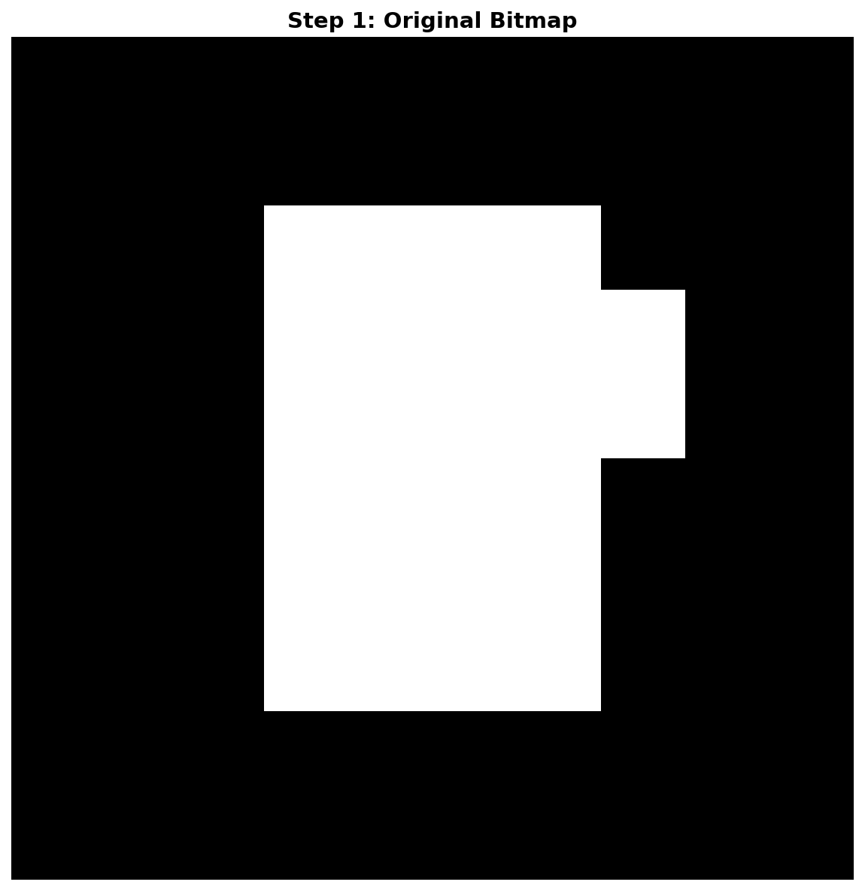
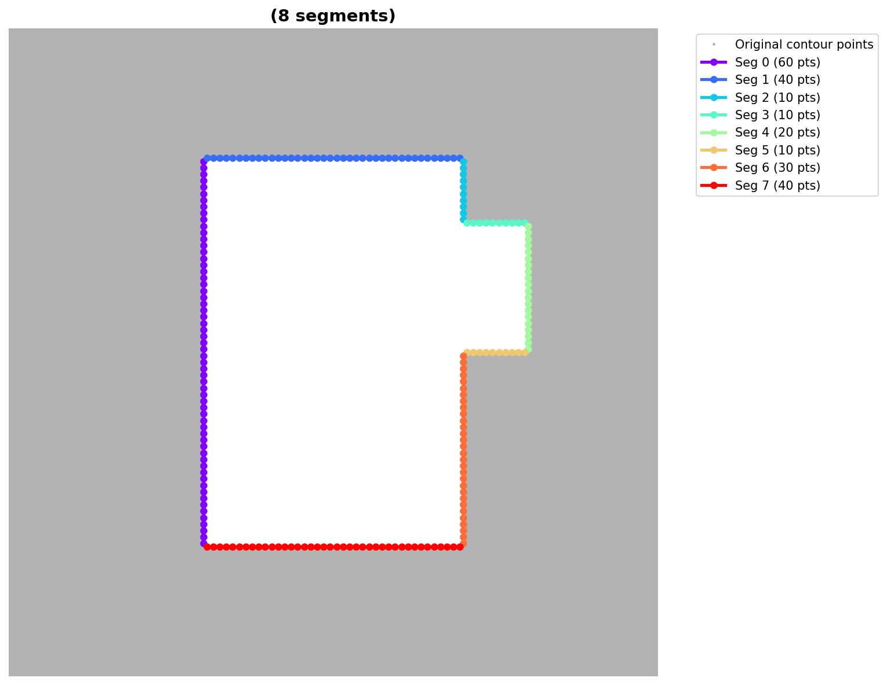

# Mask2PolyMin
Package to turn noisy raster segmentation masks into clean polygons with a minimal number of segments.

Useful for post‑processing bitmask segmentation outputs from models such as MaskRCNN or YOLO‑Seg, especially when regular or low‑complexity shapes are required:
- obtaining simple geometric representations
- to reconstruct artificial objects that consist of straight edges, sharp corners, and regular geometric properties.

Unlike common point‑thinning algorithms (Ramer–Douglas–Peucker, Visvalingam–Whyatt, Zhang–Suen), this method:
- minimizes segment count while preserving the raw shape
- does not shrink the area or remove corners
- reconstructs corners with sub-pixel accuracy: vertices are intersections of least-squares fitted lines.

## Algorithm

The input is an ordered sequence of contour points, open or closed. Lines are fitted by total least squares (minimizing perpendicular distances), and the segmentation is refined top-down:

1. **Fit** a single line to the whole sequence.
2. **Split** the worst-fitting segment at its midpoint — a segment needs splitting when its mean squared deviation exceeds `tolerance²` or any single point lies farther than `tolerance` from its line.
3. **Adjust**: slide each junction between neighboring segments to the cut with the lowest total squared error, re-fitting the segments as points change sides; a point far from both lines may be left orphaned. Iterate until stable.
4. **Repeat** 2–3 until the average squared-error sum per segment is within `tolerance²`, a split no longer improves it by at least that much, or `max_segments_count` is reached.
5. **Merge** adjacent segments whose combined points still fit a single line within tolerance.
6. **Reconstruct vertices**: each corner is the intersection of the two adjacent fitted lines — sub-pixel accurate even when no input point lies at the true corner.

Thanks to precomputed cumulative moments of the sequence, fitting a line to any contiguous point range is O(1).

### Orphaned junction points
A junction point — where one fitted segment ends and the next begins — is often an outlier to one or both segments, and in a least-squares fit an outlier at the segment's end has disproportionately large influence. A single misplaced pixel can rotate the fitted line and drag the reconstructed vertex.
Mask2PolyMin therefore may leave up to `max_orphans_per_junction` (default=2) point(s) at each junction *orphaned* — assigned to no segment: a point is orphaned iff it lies farther than `tolerance` from both adjacent lines, and the orphans' mean then anchors the corner reconstruction.

## Example

python -m venv .venv && source .venv/bin/activate && pip install -r requirements-examples.txt && python example_usage.py

- The input is a dense bitmask produced by a segmentation model.


- A contour is extracted from the bitmask using skimage.measure.find_contours


- Mask2PolyMin fits a minimal‑segment polyline to this contour



- `fit()` returns `(polygon, segments)`: a closed polygon of float (sub-pixel) vertices, ready for GeoJSON/SVG/COCO export, plus the underlying fitted segments

## Performance
The implementation is optimized, uses NumPy broadcasting.

## future work and ideas
- performance tests and comparison
- Generalize orphaning to segment interiors ?
- explore line fitting with Theil–Sen and respectively the Median or Mean Absolute Error as stop criterion ?

## Running Tests

```bash
.venv/bin/pytest test/
```

Tests run headless by default (no plot windows). To show plots during a test run:

```bash
SHOW_PLOTS=1 .venv/bin/pytest test/
```

Install dev dependencies first if needed: `pip install -r requirements-dev.txt`


